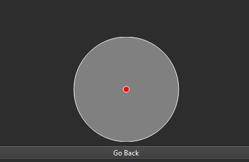

# JoystickToMouseApplication

## Joystick to Mouse Application, written in C++ using Qt, SDL, and CMake

This application converts Joystick/Controller input into mouse inputs via SDL3.

## Features

Functionality and GUI is built in Qt 6.9.2 and reads in whatever joystick/controller is plugged in and maps button 0 and 1 to left and right click, whilst movement is handled via joystick movement.
The "hat" controls on the Joystick act as the scroll wheel. Currently there are three screens, main menu, activation of the joystick screen, and a settings screen.
The activation screen has an image depicting the current position of the joystick in order to help show joystick range to the mouse. It also has a dashed gray line indicating a "dead zone" so the controller isn't super sensitive to movement.
Keybinds and settings can be changed and currently whats changeable are 
- Left and Right click
- Sensitivity of the mouse
- DPI up and down buttons
- How much the DPI affects sensitivity
Controller are selected at the main menu and activation only proceeds when at least one valid controller is present. A combo box is used for selection.

I am testing this all with a Logitech 3D Extreme Pro Joystick.

The red circle in the middle moves around and is bounded by outer grey circle.

## Tech Stack
- C++ 20
- Qt 6.9.2
- SDL3
- CMake 3.21

## Future Plans

Some potential future plans with this project are: 
- Add a few more functionality that traditional mouses cannot preform due to the large amount of buttons on joysticks
- Integrate full controller support
- Updated visuals
